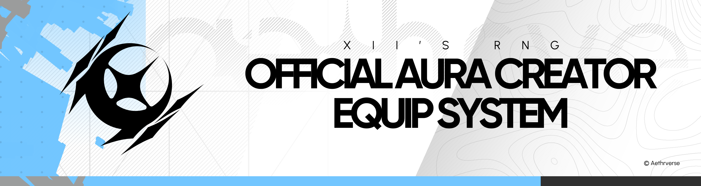

# ✨ AuraHandler ~ xii's rng


A performant module for equipping and unequipping auras on players in xii's RNG game.

## 📦 What's Included
| File | Path | Description |
| --- | --- | --- |
| [AuraHandler.luau](./src/Modules/AuraHandler.luau) | ReplicatedStorage/Modules | Main module to equip / unequip auras |
| [Aura.luau](./src/Types/Aura.luau) | ReplicatedStorage/Types | Type definition for aura prefabs |
| [Serializer.luau](./src/Modules/Serializer.luau) | ServerScriptService/Modules | Converts aura instances into typed tables usable by AuraHandler |
| [Example.luau](./src/Example.luau) | ServerScriptService | Example script showing full setup and aura equipping |
| [Baseplate.rbxl](./src/Places/AuraHandler_Baseplate.rbxl) | - | A place to find all scripts pre-installed |

---

## 🚀 Usage — Baseplate

Download and open the `.rbxl` file with Roblox Studio. This opens a small island with the correct lighting and scripts pre-installed, including a template aura to test with.

### ⚙️ Setup

1. Add your aura to the `Auras` folder in **ServerStorage**.
2. Clean your aura — remove unused attachments, Motor6Ds, faces, etc.
3. Add your aura animations (`Idle`, `Run`, ...) in the Animations config. Use the full asset ID format: `rbxassetid://...`
4. In **ServerScriptService**, open `AuraEquipTemp`. At the bottom of the Properties panel, find the Attribute and set it to the name of your aura. **Casing matters.**
5. Click Play and check the Output for any errors.

### ⚠️ Common Errors

> `[AuraEquipTemp] Aura: '...' doesnt exist in Registry!`

The aura name doesn't match what's in the Auras folder — check your spelling and casing.

> `Couldn't serialize instance ServerStorage.Auras.Common`

Something is missing from your aura structure (e.g. the Model or a required value).

---

## 🔧 Usage — Manual

📥 Download: [AuraHandler.luau](./src/Modules/AuraHandler.luau), [Aura.luau](./src/Types/Aura.luau), and [Serializer.luau](./src/Modules/Serializer.luau)

Place the modules in the following locations:

```
ReplicatedStorage
├─┬─ Modules
│ └──── AuraHandler.luau
└─┬─ Types
  └──── Aura.luau

ServerScriptService
└─┬─ Modules
  └──── Serializer.luau
```

### 🗂️ Aura Structure

Each aura is a `Configuration` instance inside `ServerStorage/Auras`. Keep them in ServerStorage so clients can't access the raw data.

```
ServerStorage
└─┬─ Auras
  └─┬─ AuraName           -> Configuration
    ├──── Chance          -> IntValue      (used for weighted random selection)
    ├──── Name            -> StringValue   (display name)
    ├──── Model           -> Model         (visual parts, organised by body part name)
    ├─┬─ Animations       -> Configuration
    │ ├──── Idle          -> StringValue   (animation asset ID, or "" to skip)
    │ ├──── Run           -> StringValue
    │ └──── ...
    └─┬─ Scripts          -> Configuration
      └──── ...           -> Script / LocalScript / ModuleScript
```

The `Model` should contain child parts named after the character body parts they attach to (e.g. `Head`, `UpperTorso`). Parts are cloned onto the matching body part and welded automatically via Motor6D.

### 📄 Script Usage

Create a Script in ServerScriptService — this is your entry point. Add a string Attribute named `EquipAura` (Properties → Attributes → +) and set its value to your aura's name.

#### 0. Read script attributes

Pull the aura name from the script's Attribute so the rest of the script doesn't depend on hardcoded strings:

```lua
local AURA_TO_EQUIP = script:GetAttribute("EquipAura")
```

#### 1. Initialise the Serializer

Call `Serializer.Init` once at the top of your server script, registering converters for every instance type used in your aura structure:

```lua
local Serializer = require("@game/ServerScriptService/Modules/Serializer")
Serializer.Init { 
    Converters = {
        Serializer.SimpleConverterFromValueBase("IntValue"),
        Serializer.SimpleConverterFromValueBase("StringValue"),
        Serializer.SimpleConverterFromClass("Model"),
        Serializer.SimpleConverterFromClass("Configuration")
    } 
}
```

#### 2. Define Serializer Params

Map each aura key to its converter type. The order of `Keys` and `Converters` must match the fields in `Aura.Prefab`:

```lua
local t_Aura = require("@game/ReplicatedStorage/Types/Aura")

local auraSerializerParams: Serializer.t_Params<t_Aura.Prefab> = { 
    Keys = { "Name", "Chance", "Model", "Animations", "Scripts" },
    Converters = { "StringValue", "IntValue", "Model", "Configuration", "Configuration" }
}
```

#### 3. Load the Aura Registry

Use `Serializer.Batch` to serialise every aura in the folder into a typed table:

```lua
local ServerStorage = game:GetService("ServerStorage")

local auraRegistry = Serializer.Batch<t_Aura.Prefab>(auraSerializerParams, ServerStorage:FindFirstChild("Auras"))
```

#### 4. Find and Equip a Specific Aura

Loop through the registry to find your aura by name, then equip it on all current players:

```lua
local Players = game:GetService("Players")
local auraHandler = require("@game/ReplicatedStorage/Modules/AuraHandler")

local foundAura: t_Aura.Prefab? = nil
for _, aura in auraRegistry do
    if aura.Name == AURA_TO_EQUIP then
        foundAura = aura
    end
end
if not foundAura then warn(`[{script.Name}] Aura: '{AURA_TO_EQUIP}' doesnt exist in Registry!`) return end

for _, plr in Players:GetPlayers() do
    local ah = auraHandler.new(plr)
    task.defer(function()
        ah:SwapAura(foundAura :: t_Aura.Prefab)
    end)
end
```

#### 5. Unequip / Swap

```lua
ah:UnequipAura()        -- removes model parts, stops animations, destroys scripts
ah:SwapAura(otherAura)  -- unequips current then equips a new one
```

#### 6. Motor Utilities (optional)

Two helpers for looking up Motor6Ds on a character by part name:

```lua
-- Returns the Motor6D whose Part1 matches the named instance, or nil
local motor = AuraHandler.GetMotor(character, "PartName")

-- Returns a map of name → Motor6D for multiple parts at once
local motors = AuraHandler.GetMotors(character, { "Head", "UpperTorso" })
```
